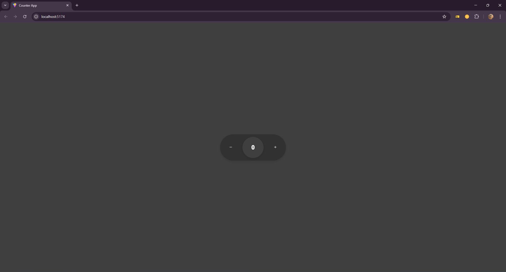

Counter App 🧮
A sleek and interactive counter application built with React. Users can increment, decrement, or reset the counter using clicks or intuitive drag gestures. This project demonstrates a responsive UI with smooth animations, perfect for learning React and modern web development.

✨ Features

➕ Increment: Increase the counter with a single click.
➖ Decrement: Decrease the counter with a single click.
🔄 Reset: Drag the button downward to reset the counter.
🖱️ Gesture Support: Works with both mouse and touch inputs.
🎨 Smooth Animations: Engaging visual feedback for interactions.
📱 Responsive Design: Optimized for mobile and desktop devices.

📸 Demo

Drag or click the button to interact with the counter.

🚀 Getting Started
Follow these steps to run the Counter App locally.
Prerequisites

Node.js (v16 or higher)
npm or yarn package manager

Installation

Clone the Repository:git clone https://github.com/UnknownXstark/counter-app.git

Navigate to the Project Directory:cd counter-app

Install Dependencies:npm install

Run the Development Server:npm run dev

Open your browser and visit http://localhost:5173 (or the port displayed in the terminal).

⚙️ Tech Stack

React: Frontend library for dynamic UI.
Vite: Lightning-fast development server and build tool.
JavaScript (ES6+): Modern JavaScript for core logic.
CSS3: Custom styling and fluid animations.
React Icons: Lightweight icons for increment/decrement buttons.

🤝 Contributing
Contributions are welcome! To contribute:

Fork the repository.
Create a new branch (git checkout -b feature/YourFeature).
Make your changes and commit (git commit -m 'Add YourFeature').
Push to the branch (git push origin feature/YourFeature).
Open a Pull Request.

Please ensure your code follows the project's coding style and includes relevant tests.

📜 License
This project is licensed under the MIT License.

🙌 Acknowledgements
This project was inspired by interactive UI design challenges and serves as a milestone in mastering React. Special thanks to the open-source community, particularly the creators of React, Vite, and React Icons.

📬 Contact
Have questions or want to connect? Reach out!

GitHub: @UnknownXstark
Email: nathanlouiskalio@gmail.com
